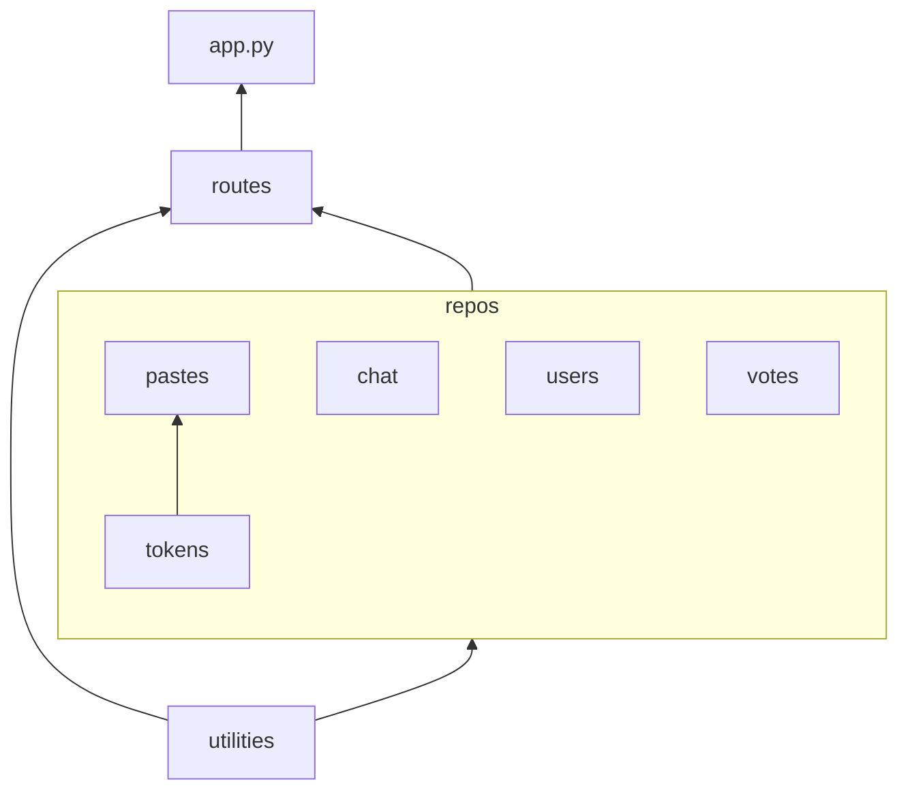

# Repository structure

Python modules have different import rules depending on where they are placed.

* **Utilities** are not allowed to import any other modules.
* **Repositories** are allowed to import utilities. They can also import other repository modules, as long as they do not form a cyclic import loop.
* **Routes** can import repositories and utilities.
* **app.py** may only import routes.

Module `app.py` is, however, an exception. It is allowed to be imported by any other module.

